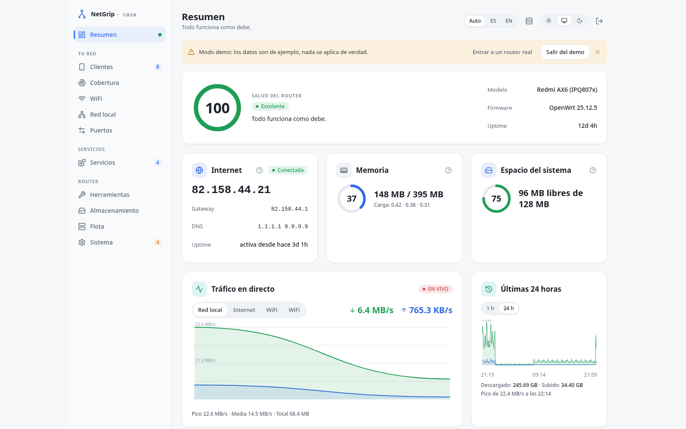
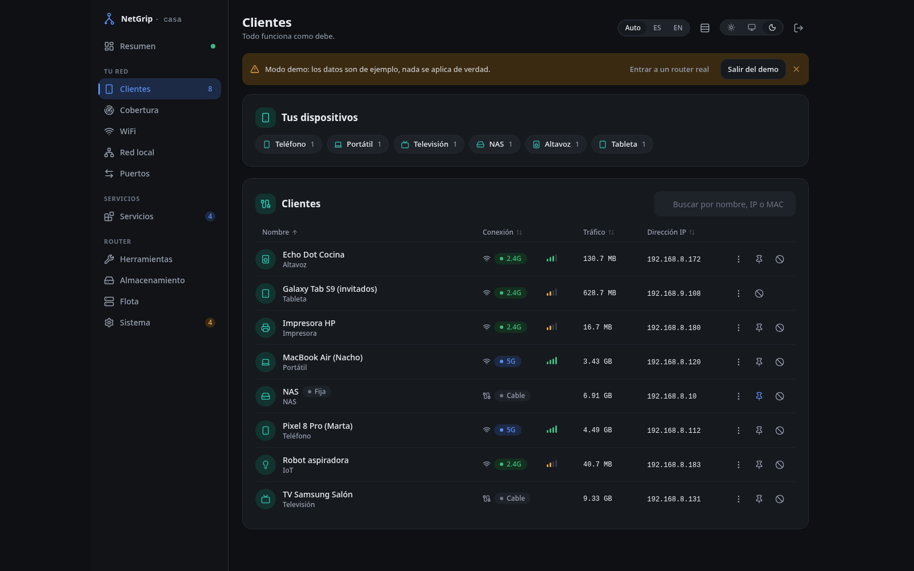
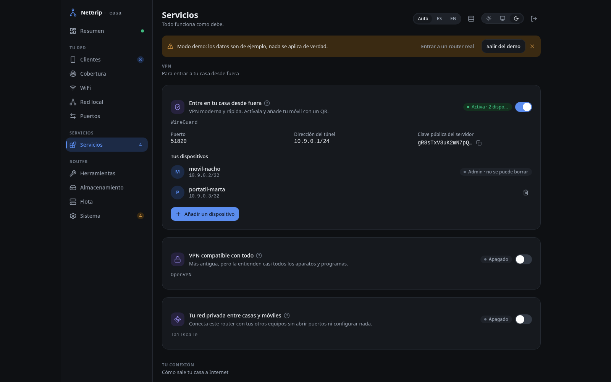
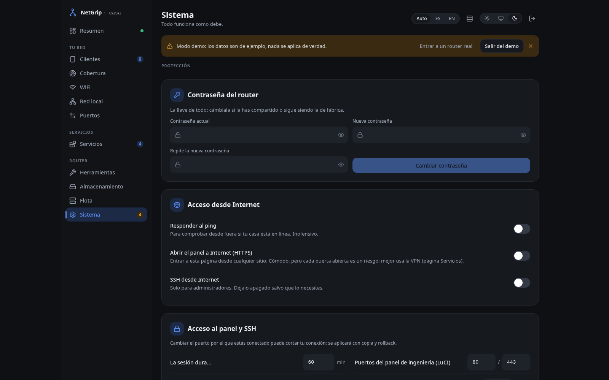

# NetGrip

<p align="center">
  <a href="README.es.md">Español</a> |
  <a href="README.md">English</a>
</p>

<p align="center">
  <a href="https://github.com/gnacho/netgrip/releases"></a>
  <a href="LICENSE"></a>
  <a href="https://netgrip.cloudless.club"></a>
  <a href="https://demo.netgrip.cloudless.club"></a>
</p>

<p align="center">
  <picture>
    <source media="(prefers-color-scheme: dark)" srcset="assets/hero-es-dark.png">
    
  </picture>
</p>

NetGrip es un panel companion ligero que corre en un router OpenWrt.
Acompaña a LuCI, no lo sustituye: un dashboard y toggles de servicios
(WireGuard, OpenVPN, DNS, QoS, Wi-Fi de invitados y de IoT...) que despliegan
configuración real con snapshot, health check y rollback automático. Corre
como un único binario estático, así que unos pocos clics sustituyen a leer
ficheros de configuración del router.

Pruébalo sin instalar nada: la **[demo online](https://demo.netgrip.cloudless.club)**
funciona con datos de ejemplo y no se aplica nada de verdad. La web del
proyecto es **[netgrip.cloudless.club](https://netgrip.cloudless.club)**.

## ¿Por qué existe esto?

No paraba de ceder portátiles con OpenWrt a gente que solo quiere un Wi-Fi
que funcione y una VPN. LuCI está bien, pero es una herramienta de
ingenieros: cada toggle pide un nombre de sección, una interfaz y una opción
que editar. Los portales de los fabricantes (el de GL.iNet es el que más vi)
son lo contrario, pero son apps cerradas de una sola página que solo
funcionan en el firmware de ese fabricante. Quería algo intermedio: la
inspección y el control de un router de verdad, detrás de botones que un
familiar pueda pulsar. Así que NetGrip toma el servicio que LuCI ya expone a
través de rpcd (el mismo session login y contraseña que LuCI) y le pone un
interruptor delante. Activar un servicio escribe la config, espera, comprueba
que levantó y se deshace si no lo hizo. Esa es casi toda la idea. Lleva
funcionando en los routers de casa desde el primer spike de dos ficheros.

## ¿Por qué este stack?

- **Go, un único binario estático** - un solo build con CGO_ENABLED=0 para el
  router, ~6 MB en disco, ~7 MB de RAM. No hay runtime que instalar ni Node
  en un router.
- **Go embed para el frontend** - la UI React va compilada dentro del
  binario, así que el paquete es un fichero y el router sirve la app él
  mismo.
- **Auth por sesión rpcd, sin base de datos de usuarios** - un router tiene un
  admin, no una tabla de usuarios. NetGrip valida el login contra rpcd (la
  misma sesión que usa LuCI) y guarda una cookie firmada. Nada extra que
  administrar.
- **Paquete OpenWrt, no un script copiado a mano** - el CI construye `.apk` y
  `.ipk` con el SDK de OpenWrt. Los paquetes sobreviven a sysupgrade
  (owut/ASU los conserva); un binario soltado a mano muere en cada
  actualización de firmware.
- **Lo que descarté** - sin SQLite y sin cuentas de usuario, porque un router
  es stateless y monoadmin; sin app luci en ucode, porque Go con una SPA
  embebida da un solo artefacto para los routers que tengo en vez de una
  LuCI por servicio; sin Docker, que no es así como funciona OpenWrt.

## Características

- **Toggles de servicio con rollback real** - cada toggle hace snapshot de
  la config UCI, aplica el cambio con un executor en allowlist, ejecuta un
  health check y revierte automáticamente si el servicio no levanta.
- **WireGuard y OpenVPN** - activar, añadir peers y descargar las configs de
  cliente (OpenVPN entrega un `.ovpn` listo; los peers de WireGuard suman un
  código QR).
- **DNS, QoS y DDNS** - protección rebind, DNS sobre VPN, SQM basado en cake
  con nota de bufferbloat, y un toggle de DNS dinámico.
- **Wi-Fi de invitados y de IoT** - una red de invitados en su propia subred
  aislada, y una red de IoT con aislamiento de AP, ambas a un clic.
- **Cambio Router/AP** - mover el puerto WAN y el rol de DHCP/firewall con
  snapshot y rollback, en vez de editar `network` y `firewall` a mano.
- **LAN, DHCP y reservas** - editar la IP de la LAN, el rango del DHCP y las
  reservas por MAC desde el panel.
- **Panel de puertos y tráfico en vivo** - un chasis ethernet con el estado
  por puerto, nombres de dispositivo y detección de switch no gestionado,
  más una gráfica de caudal en directo.
- **Vista de malla DAWN** - la malla de roaming dibujada como un grafo radial
  con el número de estaciones por radio.
- **Tabla de clientes** - cada estación con velocidad, señal, un clic para
  reservar IP y una acción de bloqueo.
- **Actualización de firmware** - integración con owut/ASU para reconstruir la
  imagen con los paquetes ya instalados, así el panel sobrevive al flash.
- **Entrada en LuCI** - un paquete opcional `luci-app-netgrip` embeja el
  panel en LuCI > Servicios.
- **UI en ES y EN** - la interfaz cambia de idioma con un clic.

## Capturas

Todas las capturas salen de la demo pública, así que los datos son de ejemplo.

**Inicio - salud, WAN, tráfico en vivo y el panel de puertos ethernet**

<picture>
  <source media="(prefers-color-scheme: dark)" srcset="assets/hero-es-dark.png">
  
</picture>

**Clientes - quién está en la red, con señal y uso en vivo**



**Servicios - una tarjeta por servicio: WireGuard, OpenVPN, DDNS, SQM, cortafuegos...**



**Sistema - acceso, seguridad, modo Router/AP y el asistente de primer arranque**



## Instalación

Hay dos formas de poner NetGrip en un router, según lo cómodo que te muevas
con OpenWrt.

**Para un montaje no técnico**, el camino previsto es una imagen de firmware
que ya incluya NetGrip (y su entrada de LuCI), flasheada como cualquier
imagen OpenWrt, de modo que no haya nada que instalar. Esa imagen aún no está
publicada: el plan y el trabajo que requiere un feed propio de paquetes
instalados (para que ASU/owut reconstruya la imagen con el panel dentro)
están en el
[issue #63](https://github.com/gnacho/netgrip/issues/63). Hasta que llegue, el
panel usa el paquete de **OpenWrt 25.12/24.10** correspondiente.

**Para un montaje con soltura en OpenWrt**, añade el panel desde la release
como paquete `apk` u `opkg`. Requisitos: un router ARM de 64 bits
(`aarch64_cortex-a53`, cubre MediaTek filogic y Qualcomm ipq807x) con OpenWrt
24.10 o 25.12. El panel escucha en el puerto 8080 y valida tu login contra
rpcd.

Descarga el paquete correcto para tu router y su versión de OpenWrt desde la
página de [Releases](https://github.com/gnacho/netgrip/releases/latest). Hay
dos formatos construidos con el SDK de OpenWrt: `.apk` (OpenWrt 25.12 en
adelante) y `.ipk` (OpenWrt 24.10).

### Instalación rápida (una línea)

Entra por SSH al router y ejecuta:

```sh
wget -qO- https://raw.githubusercontent.com/gnacho/netgrip/main/install.sh | sh
```

El script elige el paquete adecuado para la arquitectura del router
(`aarch64` o `x86_64`) y su gestor de paquetes (`apk` en OpenWrt 25.12+,
`opkg` en 24.10), instala la última release, activa y arranca el servicio, y
te imprime la URL del panel. Si prefieres revisarlo antes, lee
[install.sh](install.sh); para instalar una versión concreta, ejecuta
`NETGRIP_VERSION=vX.Y.Z sh install.sh`.

### Instalación manual

#### OpenWrt 25.12 (apk)

```sh
# Cópialo al router y luego:
apk add netgrip-0.24.0-r1-arm64.apk
/etc/init.d/netgrip enable
/etc/init.d/netgrip start
```

#### OpenWrt 24.10 (ipk)

```sh
# Cópialo al router y luego:
opkg install netgrip_0.24.0-1_aarch64_cortex-a53.ipk
/etc/init.d/netgrip enable
/etc/init.d/netgrip start
```

Abre `http://<ip-del-router>:8080` y entra con el mismo usuario y contraseña
que usas en LuCI.

<details>
<summary><strong>Instalación manual (binario suelto)</strong></summary>

Si prefieres no usar el paquete OpenWrt, descarga `netgrip-linux-arm64` de la
release y colócalo en el router. El paquete sigue siendo el camino
recomendado: sobrevive a sysupgrade; un binario suelto no.

```sh
# El dropbear de busybox no tiene scp; pasa el fichero por ssh:
cat netgrip-linux-arm64 | ssh root@<ip-del-router> "cat > /usr/sbin/netgrip && chmod 755 /usr/sbin/netgrip"
/usr/sbin/netgrip -listen 0.0.0.0 -port 8080
```

</details>

El instalador (postinst) habilita y arranca el servicio y añade el binario,
el script de init y el enlace de rc.d a `/etc/sysupgrade.conf`, así el panel
vuelve tras actualizar el firmware. En 25.12 el camino propio de reinstalación
de NetGrip también usa owut para mantener el paquete en la imagen (ver las
notas de la release).

### luci-app-netgrip (opcional)

Para embeber el panel dentro de LuCI (Servicios > NetGrip), instala del mismo
modo el paquete `luci-app-netgrip` que corresponda. El postinst reinicia
rpcd y limpia la caché del menú de LuCI para que aparezca la entrada.

### Compilar desde el código fuente

Requiere Go 1.24+ y Node 22+:

```sh
git clone https://github.com/gnacho/netgrip.git
cd netgrip

# El frontend va embebido en el binario en build.
cd app
npm ci
cd ..

CGO_ENABLED=0 GOOS=linux GOARCH=arm64 go build -o netgrip ./cmd/netgrip

# El dropbear de busybox no tiene scp; pasa el fichero por ssh:
cat netgrip | ssh root@<ip-del-router> "cat > /usr/sbin/netgrip && chmod 755 /usr/sbin/netgrip"
```

## Configuración

El binario acepta tres flags. Los valores por defecto son los que quiere la
mayoría de routers, así que normalmente no hay nada que configurar:

| Flag         | Por defecto             | Descripción                                     |
| ------------ | ----------------------- | ----------------------------------------------- |
| `-listen`    | `0.0.0.0`               | Dirección a la que enlazar.                     |
| `-port`      | `8080`                  | Puerto de escucha.                              |
| `-rpcd-url`  | `http://127.0.0.1/ubus` | Endpoint JSON-RPC de rpcd para validar el login. |

El script de init lo arranca con esos mismos valores por defecto. Para
cambiar el timeout de sesión del panel, usa la tarjeta Acceso en la UI
(`options.main.session_timeout` en UCI): afecta a los tokens emitidos desde
entonces; las sesiones existentes conservan su caducidad original.

## Uso

Tras instalar el paquete, el servicio corre desde `procd`:

```sh
# Estado y logs
/etc/init.d/netgrip status
logread -e netgrip -f

# Reiniciar
/etc/init.d/netgrip restart
```

Apunta un navegador a `http://<ip-del-router>:8080`. El login valida contra
rpcd, así que las credenciales son las mismas que las de LuCI. El panel
guarda una cookie de sesión firmada (12 h por defecto, configurable en la
tarjeta Acceso) que sobrevive a los reinicios del servicio.

La UI es la interfaz principal. También hay una API JSON para cada tarjeta,
que usa el frontend: `GET /api/board`, `/api/system`, `/api/wan`, `/api/wifi`,
`/api/lan`, `/api/dns`, `/api/dawn`, `/api/clients` para lecturas, y los
endpoints `POST` correspondientes en `/api/wireguard`, `/api/openvpn`,
`/api/sqm`, `/api/guestwifi`, `/api/iotwifi` y `/api/portforward` con la
forma `{ "state": ..., "rolled_back": ..., "status": "applied|rolled_back|failed" }`.
Cada endpoint de escritura requiere una cookie de sesión.

## Desarrollo

Stack: **Go 1.24 (binario estático único)** + **React 19 + TypeScript + Vite
+ Tailwind (embebido con go:embed)**. No hay base de datos externa.

```bash
git clone https://github.com/gnacho/netgrip.git
cd netgrip/app
npm ci
npm run dev      # servidor de desarrollo del frontend (ver vite.config.ts para el proxy /api)
go build -o netgrip ./cmd/netgrip
go test ./...
```

El workflow del CI construye el frontend, cruza el binario a arm64 y lo
empaqueta como `.apk` y `.ipk` con el SDK de OpenWrt en cada tag de release,
adjuntando ambos a la release de GitHub.

## Licencia

AGPL-3.0-only. Ver [LICENSE](LICENSE).

Construido por gnacho como proyecto personal autoalojado; issues y PRs son
bienvenidos.
