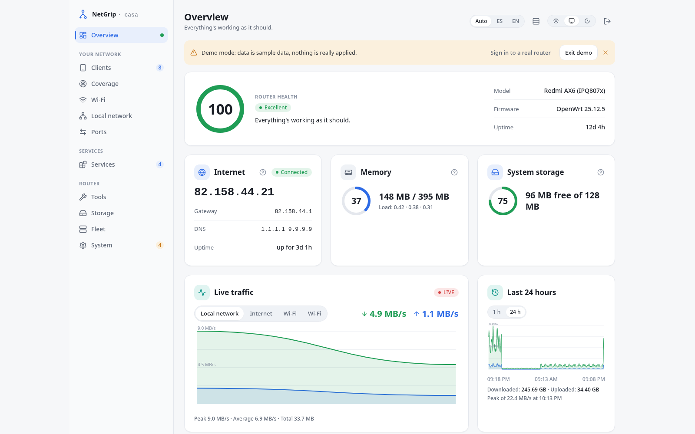
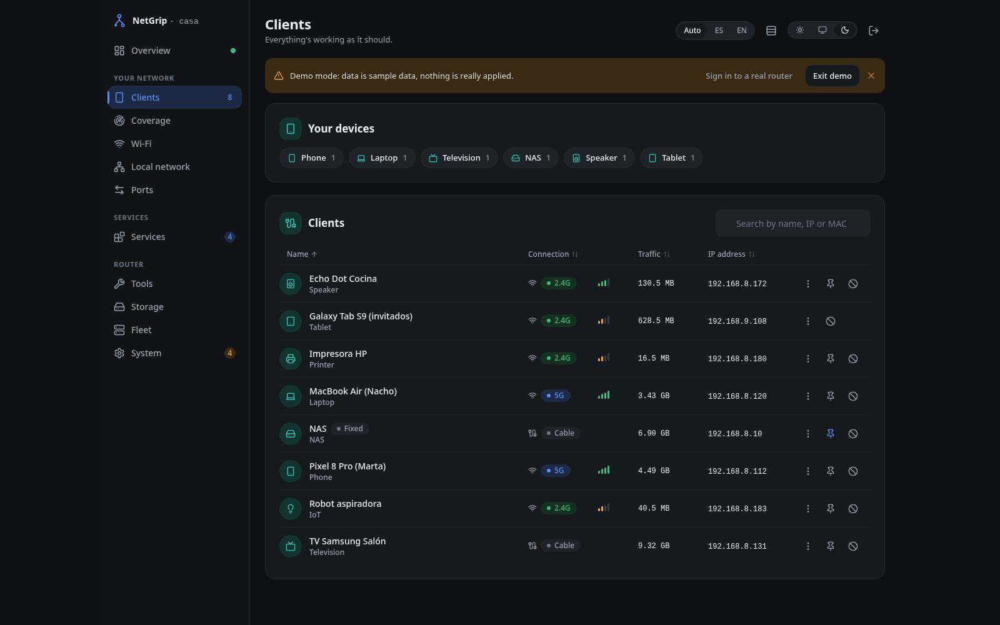
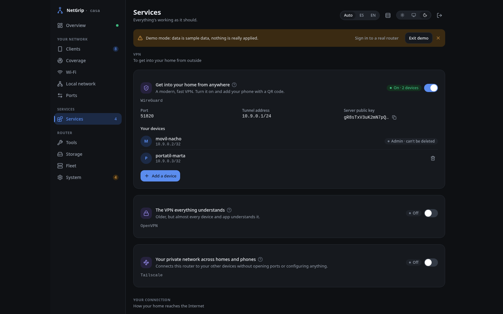
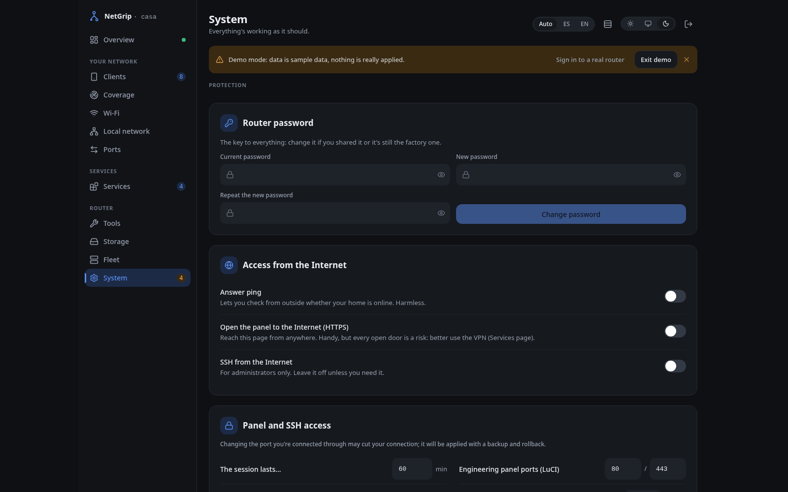

# NetGrip

<p align="center">
  <a href="README.md">English</a> |
  <a href="README.es.md">Español</a>
</p>

<p align="center">
  <a href="https://github.com/gnacho/netgrip/releases"></a>
  <a href="LICENSE"></a>
  <a href="https://netgrip.cloudless.club"></a>
  <a href="https://demo.netgrip.cloudless.club"></a>
</p>

<p align="center">
  <picture>
    <source media="(prefers-color-scheme: dark)" srcset="assets/hero-en-dark.png">
    
  </picture>
</p>

NetGrip is a lightweight companion panel that runs on an OpenWrt router. It
sits next to LuCI, not instead of it: the dashboard plus service toggles
(WireGuard, OpenVPN, DNS, QoS, guest and IoT Wi-Fi...) that deploy real
configuration with a snapshot, a health check and an automatic rollback. It
runs as a single static binary, so a handful of clicks replace reading router
config files.

Try it without installing anything: the **[online demo](https://demo.netgrip.cloudless.club)**
runs on sample data and nothing is applied for real. The project website is
**[netgrip.cloudless.club](https://netgrip.cloudless.club)**.

## Why does this exist?

I kept handing OpenWrt laptops to people who only want a working Wi-Fi and a
VPN. LuCI is fine, but it is a tool for engineers: every toggle asks for a
section name, an interface and an option to edit. Vendor portals (GL.iNet's
is the one I saw most) are the opposite, but they are closed single-page apps
that only work on that vendor's firmware. I wanted something in between: the
inspection and control of a real router, behind buttons a relative can
press. So NetGrip takes the service that LuCI already exposes through rpcd
(the same session login and password as LuCI) and puts a switch in front of
it. Turning a service on writes the config, waits, checks it came up, and
undoes itself if it did not. That is mostly the whole idea. It has been
running on my home routers since I first built the two-file spike.

## Why this stack?

- **Go, single static binary** - one CGO_ENABLED=0 build for the router,
  ~6 MB on disk, ~7 MB RAM. There is no runtime to install and no Node on a
  router.
- **Go embed for the frontend** - the React UI is compiled into the binary,
  so the package is one file and the router serves the app itself.
- **rpcd session auth, no user database** - a router has one admin, not a
  user table. NetGrip validates the login against rpcd (the same session
  LuCI uses) and keeps a signed cookie. Nothing extra to administer.
- **OpenWrt package, not a copy-paste script** - the CI builds `.apk` and
  `.ipk` with the OpenWrt SDK. Packages survive sysupgrade (owut/ASU keeps
  them); a binary dropped on the box dies on every firmware update.
- **What I left out** - no SQLite and no user accounts, because a router is
  stateless and single-admin; no ucode/luci app, because Go plus an embedded
  SPA gives one artifact for the routers I own instead of a LuCI per
  service; no Docker, that is not how OpenWrt works.

## Features

- **Service toggles with real rollback** - each toggle snapshots the UCI
  config, applies the change with an allowlisted executor, runs a health
  check and rolls back automatically if the service does not come up.
- **WireGuard and OpenVPN** - enable, add peers, and download client configs
  (OpenVPN ships a ready `.ovpn`; WireGuard peers add a QR code).
- **DNS, QoS and DDNS** - rebind protection, DNS over VPN, cake-based SQM
  with a bufferbloat grade, and a dynamic DNS toggle.
- **Guest and IoT Wi-Fi** - a guest network on its own isolated subnet, and
  an IoT network with AP isolation, both one click away.
- **Router/AP switch** - move the WAN port and the DHCP/firewall role with a
  snapshot and rollback, instead of editing `network` and `firewall` by hand.
- **LAN, DHCP and reservations** - edit the LAN IP, the DHCP scope and
  per-MAC reservations from the panel.
- **Port panel and live traffic** - an ethernet chassis with per-port
  state, device names and unmanaged-switch detection, plus a live throughput
  chart.
- **DAWN mesh view** - the roaming mesh rendered as a radial graph with
  per-radio station counts.
- **Clients table** - every station with speed, signal, a one-click
  reserved IP and a block action.
- **Firmware updates** - owut/ASU integration to rebuild the image with the
  packages already installed, so the panel survives a flash.
- **LuCI entry** - an optional `luci-app-netgrip` package embeds the panel
  under LuCI > Services.
- **ES and EN UI** - the interface switches language in one click.

## Screenshots

All screenshots come from the public demo, so the data is sample data.

**Overview - health, WAN, live traffic and the ethernet port panel**

<picture>
  <source media="(prefers-color-scheme: dark)" srcset="assets/hero-en-dark.png">
  
</picture>

**Clients - who is on the network, with signal and live usage**



**Services - one card per service: WireGuard, OpenVPN, DDNS, SQM, firewall...**



**System - access, security, Router/AP mode and the first-run wizard**



## Installation

There are two ways to get NetGrip on a router, depending on how comfortable
you are with OpenWrt.

**For a non-technical setup** the intended path is a firmware image that
already includes NetGrip (and its LuCI entry), flashed like any OpenWrt
image, so there is nothing to install. That image is not published yet: the
plan and the work needed for a custom installed-packages feed (so ASU/owut
rebuilds the image with the panel inside) is tracked in
[issue #63](https://github.com/gnacho/netgrip/issues/63). Until that lands,
the panel uses the matching **OpenWrt 25.12/24.10 package**.

**For an OpenWrt-savvy setup**, add the panel from the release as an `apk` or
`opkg` package. Requirements: a 64-bit ARM router
(`aarch64_cortex-a53`, covers MediaTek filogic and Qualcomm ipq807x) running
OpenWrt 24.10 or 25.12. The panel listens on port 8080 and validates your
login against rpcd.

Download the right package for your router and its OpenWrt version from the
[Releases](https://github.com/gnacho/netgrip/releases/latest) page. There are
two formats built from the OpenWrt SDK: `.apk` (OpenWrt 25.12 and later) and
`.ipk` (OpenWrt 24.10).

### Quick install (one line)

SSH into the router and run:

```sh
wget -qO- https://raw.githubusercontent.com/gnacho/netgrip/main/install.sh | sh
```

The script picks the right package for the router's architecture (`aarch64`
or `x86_64`) and package manager (`apk` on OpenWrt 25.12+, `opkg` on 24.10),
installs the latest release, enables and starts the service, and prints the
panel URL. If you prefer to review it first, read
[install.sh](install.sh); to install a specific release, run
`NETGRIP_VERSION=vX.Y.Z sh install.sh`.

### Manual install

#### OpenWrt 25.12 (apk)

```sh
# Copy it to the router, then:
apk add netgrip-0.24.0-r1-arm64.apk
/etc/init.d/netgrip enable
/etc/init.d/netgrip start
```

#### OpenWrt 24.10 (ipk)

```sh
# Copy it to the router, then:
opkg install netgrip_0.24.0-1_aarch64_cortex-a53.ipk
/etc/init.d/netgrip enable
/etc/init.d/netgrip start
```

Open `http://<router-ip>:8080` and log in with the same username and password
you use for LuCI.

<details>
<summary><strong>Manual install (bare binary)</strong></summary>

If you prefer not to use the OpenWrt package, download `netgrip-linux-arm64`
from the release and place it on the router. The package is still the
recommended path: it survives sysupgrade, a bare binary does not.

```sh
# Busybox dropbear has no scp; pipe the file instead:
cat netgrip-linux-arm64 | ssh root@<router-ip> "cat > /usr/sbin/netgrip && chmod 755 /usr/sbin/netgrip"
/usr/sbin/netgrip -listen 0.0.0.0 -port 8080
```

</details>

The installer (postinst) enables and starts the service and adds the binary,
the init script and the rc.d link to `/etc/sysupgrade.conf`, so the panel
comes back after a firmware update. On 25.12 NetGrip's own reinstall path also
uses owut to keep the package in the image (see the release notes).

### luci-app-netgrip (optional)

To embed the panel inside LuCI (Services > NetGrip), install the matching
`luci-app-netgrip` package the same way. The postinst restarts rpcd and
clears the LuCI menu cache so the entry appears.

### Build from source

Requires Go 1.24+ and Node 22+:

```sh
git clone https://github.com/gnacho/netgrip.git
cd netgrip

# Frontend is embedded into the binary at build time.
cd app
npm ci
cd ..

CGO_ENABLED=0 GOOS=linux GOARCH=arm64 go build -o netgrip ./cmd/netgrip

# Busybox dropbear has no scp; pipe the file to the router instead:
cat netgrip | ssh root@<router-ip> "cat > /usr/sbin/netgrip && chmod 755 /usr/sbin/netgrip"
```

## Configuration

The binary takes three flags. The defaults are what most routers want, so
usually there is nothing to set:

| Flag         | Default                  | Description                                   |
| ------------ | ------------------------ | --------------------------------------------- |
| `-listen`    | `0.0.0.0`                | Address to bind.                              |
| `-port`      | `8080`                   | Port to listen on.                            |
| `-rpcd-url`  | `http://127.0.0.1/ubus`  | rpcd JSON-RPC endpoint for login validation.  |

The init script starts it with the same defaults. To change the panel session
timeout, use the Access card in the UI (`options.main.session_timeout` in
UCI): it affects tokens issued from then on, existing sessions keep their
original expiry.

## Usage

After a package install, the service runs from `procd`:

```sh
# Status and logs
/etc/init.d/netgrip status
logread -e netgrip -f

# Restart
/etc/init.d/netgrip restart
```

Point a browser at `http://<router-ip>:8080`. The login validates against
rpcd, so the credentials are the same as LuCI. The panel keeps a signed
session cookie (12 h by default, configurable in the Access card) that
survives service restarts.

The UI is the main interface. There is also a JSON API for every card, used
by the frontend: `GET /api/board`, `/api/system`, `/api/wan`, `/api/wifi`,
`/api/lan`, `/api/dns`, `/api/dawn`, `/api/clients` for reads, and the
matching `POST` endpoints through `/api/wireguard`, `/api/openvpn`,
`/api/sqm`, `/api/guestwifi`, `/api/iotwifi` and `/api/portforward` with a
`{ "state": ..., "rolled_back": ..., "status": "applied|rolled_back|failed" }`
shape. Every write endpoint requires a session cookie.

## Development

Stack: **Go 1.24 (single static binary)** + **React 19 + TypeScript + Vite +
Tailwind (embedded with go:embed)**. There is no external database.

```bash
git clone https://github.com/gnacho/netgrip.git
cd netgrip/app
npm ci
npm run dev      # frontend dev server (see vite.config.ts for the /api proxy)
go build -o netgrip ./cmd/netgrip
go test ./...
```

The CI workflow builds the frontend, cross-compiles the arm64 binary and
packages it as `.apk` and `.ipk` with the OpenWrt SDK on every release tag,
attaching both to the GitHub release.

## License

AGPL-3.0-only. See [LICENSE](LICENSE).

Built by gnacho as a personal self-hosted project; issues and PRs are
welcome.
